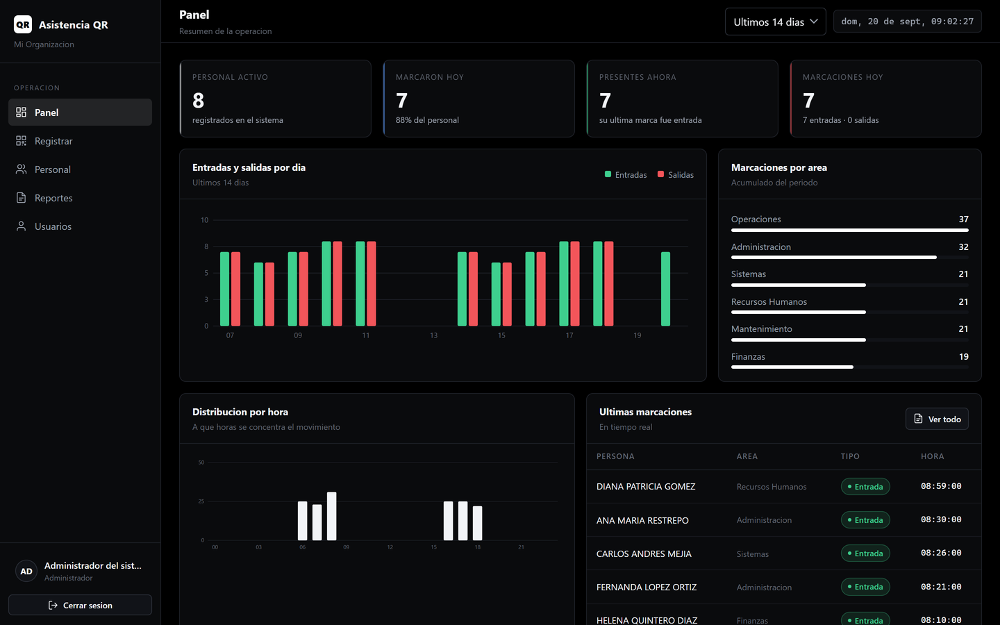
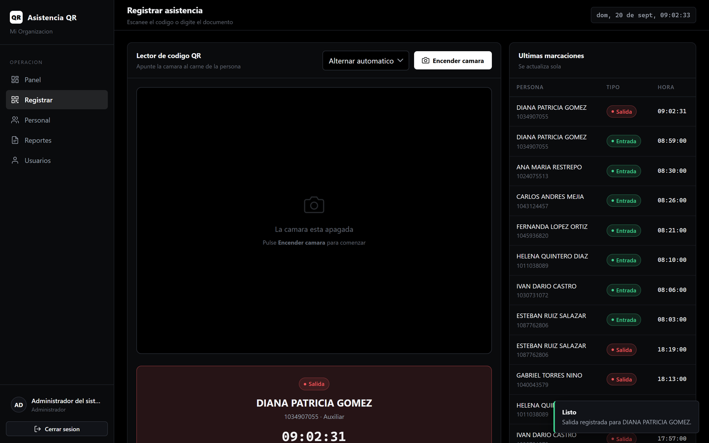
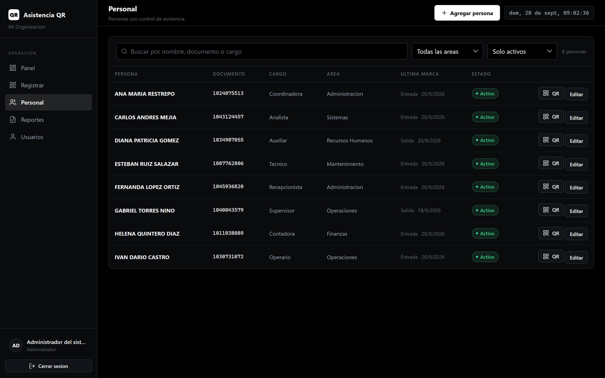
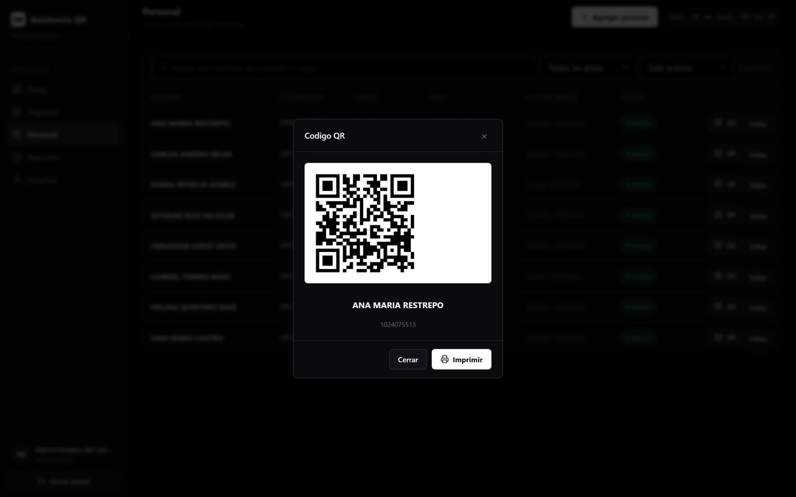
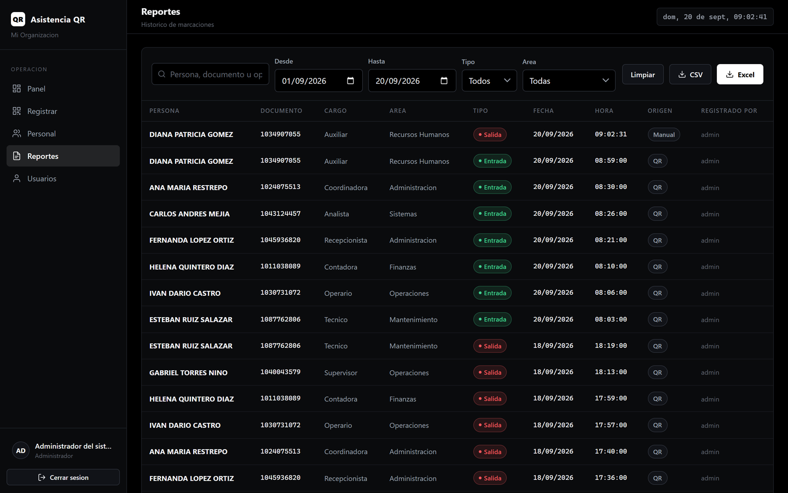
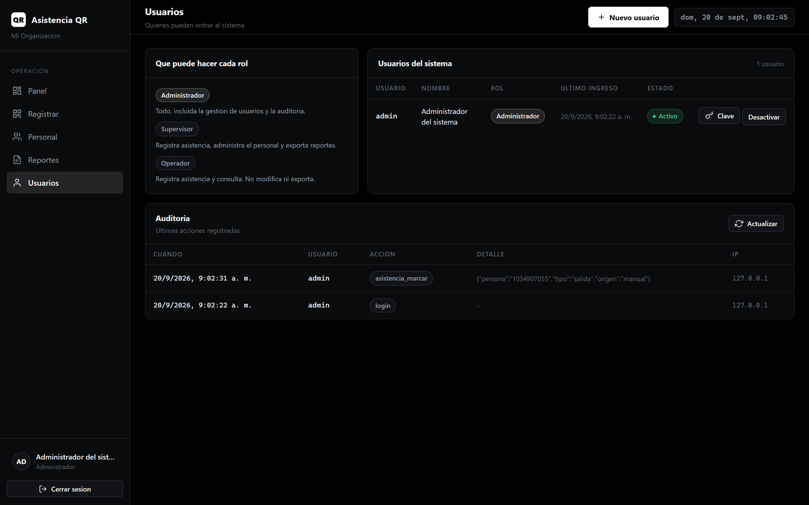
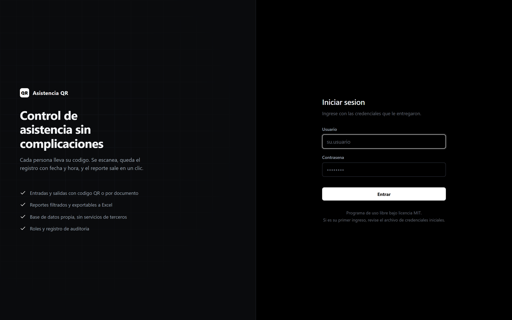
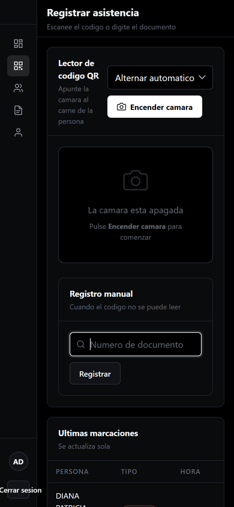

<div align="center">


# Asistencia QR

**Control de asistencia por código QR.** Cada persona lleva su código,
se escanea al entrar y al salir, y el reporte sale en un clic.

[](LICENSE)
[](https://nodejs.org)
[](#por-qué-sqlite)

</div>

---

## Qué resuelve

Llevar la asistencia en papel o en una hoja de cálculo se rompe siempre por el
mismo lado: nadie sabe quién está dentro, las horas se copian mal y armar el
reporte de fin de mes es un día entero de trabajo.

Este sistema registra la marcación en el momento exacto en que ocurre, con la
hora del servidor y no la del reloj de quien anota, y deja el historial listo
para filtrar y exportar.

No necesita internet, ni servidor de base de datos, ni cuenta en ningún
servicio. Funciona en un equipo de recepción y, si se quiere, los demás
equipos de la red local entran por el navegador.

## Cómo se ve

<div align="center">



**Panel.** Quiénes están dentro ahora, cuántos marcaron hoy y el movimiento del período.
Se refresca solo, así que sirve de tablero en recepción.

<br>



**Registrar.** Se escanea el carné y la confirmación aparece con el nombre y la hora.
El sistema alterna entrada y salida solo; el operador no tiene que acordarse.

<br>

<table>
<tr>
<td width="50%"></td>
<td width="50%"></td>
</tr>
<tr>
<td align="center"><b>Personal.</b> Alta, búsqueda y filtro por área.</td>
<td align="center"><b>Carné.</b> El QR se imprime o se guarda en PDF.</td>
</tr>
<tr>
<td></td>
<td></td>
</tr>
<tr>
<td align="center"><b>Reportes.</b> Filtros por fecha, tipo y área. Excel y CSV.</td>
<td align="center"><b>Usuarios.</b> Roles y registro de auditoría.</td>
</tr>
</table>

<br>



<br><br>



**En el teléfono.** La misma pantalla de registro, para marcar con la cámara del celular.

</div>

---

## Instalación

### Windows — instalador

Descargue `AsistenciaQR-2.0.0-instalador.exe` desde
[Releases](https://github.com/Losif24/AsistenciaQR/releases) y ejecútelo.

El instalador se encarga de todo:

1. Comprueba si el equipo tiene Node.js y **lo instala si falta**.
2. Descarga las librerías del proyecto.
3. Crea la base de datos con su esquema y el usuario administrador.
4. Deja los accesos directos y, si lo pide, abre el puerto en el cortafuegos.

Solo le preguntará el nombre de su organización y el puerto.

### Windows — desde el código

```bash
git clone https://github.com/Losif24/AsistenciaQR.git
cd AsistenciaQR
```

Doble clic en `instalar.bat`, o desde una terminal:

```bash
powershell -ExecutionPolicy Bypass -File scripts\instalar.ps1
```

### Linux y macOS

```bash
git clone https://github.com/Losif24/AsistenciaQR.git
cd AsistenciaQR
bash scripts/instalar.sh
```

### Si ya tiene Node.js 20 o superior

```bash
npm install && npm start
```

El esquema de la base de datos se crea solo la primera vez. No hay ningún
script SQL que ejecutar a mano.

## Primer ingreso

Al arrancar por primera vez el sistema crea el usuario `admin` con una
contraseña **generada al azar**, que se muestra en pantalla y queda escrita en
`data/credenciales-iniciales.txt`.

El sistema obliga a cambiarla en el primer ingreso. Cuando lo haya hecho,
borre ese archivo.

> No hay ninguna contraseña por defecto. Dos instalaciones distintas nunca
> comparten credenciales.

## Cómo se usa

| Pantalla | Para qué sirve |
|---|---|
| **Panel** | Quiénes están dentro ahora, cuántos marcaron hoy, movimiento por día, por área y por hora. Se refresca solo: sirve de tablero en recepción. |
| **Registrar** | Escanea con la cámara del equipo o del celular. También acepta un lector de mano o el documento escrito. |
| **Personal** | Alta de personas, su código QR y el carné listo para imprimir. |
| **Reportes** | Historial filtrable por fecha, tipo, área o persona. Exporta a Excel y CSV. |
| **Usuarios** | Quién puede entrar al sistema, con qué rol, y el registro de auditoría. |

### Roles

| Rol | Puede |
|---|---|
| **Administrador** | Todo, incluida la gestión de usuarios y la auditoría. |
| **Supervisor** | Registrar asistencia, administrar el personal y exportar reportes. |
| **Operador** | Registrar asistencia y consultar. No modifica ni exporta. |

### Marcar entrada y salida

El sistema **alterna solo**: si la última marca de la persona fue una entrada,
la siguiente será una salida. El operador no tiene que acordarse.

Si el lector dispara dos veces seguidas —cosa que pasa a diario— la segunda
lectura se descarta en vez de registrar una salida por error.

## Configuración

Todo vive en un archivo `.env` en la raíz. Si no existe, se usan estos valores.

| Variable | Por defecto | Qué hace |
|---|---|---|
| `PORT` | `4090` | Puerto del servidor. |
| `HOST` | `0.0.0.0` | `0.0.0.0` permite entrar desde otros equipos de la red. |
| `DB_FILE` | `data/asistencia.db` | Dónde vive la base de datos. |
| `TZ` | `America/Bogota` | Zona horaria de fechas, horas y reportes. |
| `SESSION_SECRET` | *(se genera sola)* | Clave para firmar las cookies de sesión. |
| `SESSION_HOURS` | `12` | Cuánto dura la sesión abierta. |
| `ORG_NAME` | `Mi Organizacion` | Aparece en la interfaz y en los reportes. |

Para acceder desde otros equipos, use la dirección que el servidor imprime al
arrancar, por ejemplo `http://192.168.1.11:4090`.

> **La cámara necesita HTTPS** fuera de `localhost`. Es una restricción de los
> navegadores, no del sistema. En equipos de la red, use el lector de mano o el
> registro por documento, o ponga el sistema detrás de un proxy con certificado.

## Comandos

```bash
npm start        # arranca el servidor
npm run dev      # arranca y recarga al guardar cambios
npm test         # ejecuta las pruebas
npm run demo     # llena la base con datos de ejemplo para ver el panel
npm run init-db  # aplica el esquema sin arrancar el servidor
npm run reset-db # borra todo y reconstruye desde cero
```

## Por qué SQLite

La base es un solo archivo en `data/`. No hay servicio que arrancar, ni
usuario de base de datos que crear, ni puerto que abrir.

Se usa `node-sqlite3-wasm`: SQLite compilado a WebAssembly. No tiene binarios
nativos, así que `npm install` funciona igual en Windows, Linux y macOS, sin
compilador y sin sorpresas de compatibilidad al cambiar de versión de Node.

Para respaldar, copie la carpeta `data/`. Para mudar el sistema a otro equipo,
copie esa misma carpeta.

## El esquema

Se crea solo al arrancar y se versiona con `PRAGMA user_version`, de modo que
actualizar la aplicación nunca exige trabajo manual.

| Tabla | Guarda |
|---|---|
| `usuarios` | Quiénes entran al sistema, con su rol y la contraseña derivada con scrypt. |
| `personal` | Las personas a las que se controla la asistencia, y su código QR. |
| `asistencia` | Las marcaciones. |
| `sesiones` | Las sesiones abiertas, del lado del servidor. |
| `auditoria` | Rastro de las acciones sensibles. |

Cada marcación guarda el instante exacto en UTC como única fuente de verdad, y
la fecha y hora locales aparte para poder filtrar e indexar rápido.

El código QR **no lleva el número de documento**: lleva un identificador
aleatorio. Así el carné no expone datos personales y nadie puede fabricar un
código conociendo la cédula de otro. Si alguien pierde el carné, se regenera
el código y el anterior deja de servir.

## Seguridad

- Contraseñas derivadas con **scrypt** y sal por usuario. Nunca se guarda el texto plano.
- Sesiones del lado del servidor, con cookie firmada, `HttpOnly` y `SameSite=Lax`.
- Permisos comprobados **en el servidor** en cada petición, no solo en la interfaz.
- Todas las consultas usan parámetros enlazados.
- Cabeceras de seguridad con Helmet y una política de contenido estricta.
- Límite de intentos de inicio de sesión y límite general de peticiones.
- El primer administrador nace con una contraseña aleatoria que hay que cambiar.

En [docs/AUDITORIA.md](docs/AUDITORIA.md) está el detalle de qué se encontró en
la versión anterior del proyecto y cómo se corrigió cada punto.

## Desarrollo

```
src/
  app.js            armado de Express y montaje de rutas
  server.js         arranque, migración y apagado ordenado
  config.js         configuración y valores por defecto
  db/               conexión, esquema, migraciones y datos iniciales
  lib/              contraseñas, sesiones, fechas, validación, registro
  middleware/       autenticación, roles y manejo de errores
  routes/           la API
public/
  *.html            una página por pantalla
  js/core.js        peticiones, armazón, avisos e iconos
  js/graficas.js    gráficas en SVG, sin librería externa
  css/app.css       toda la hoja de estilos
test/               pruebas con el runner de Node
```

No hay paso de compilación. El navegador carga los módulos tal como están en
`public/`: lo que se lee es lo que se ejecuta.

```bash
npm test
```

## Licencia

[MIT](LICENSE). Úselo, modifíquelo y distribúyalo con libertad, incluso con
fines comerciales.
